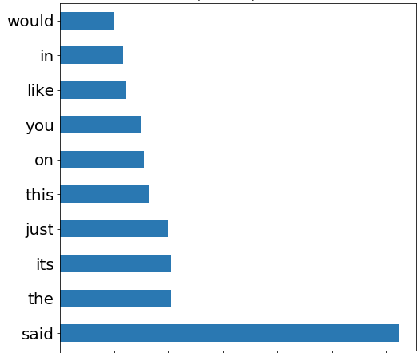

# Fake News Classification

# Author: Michael Erb

image from pngegg.com

# Problem

Our social media company has been accused of allowing “fake news” to proliferate on our site. We are facing a backlash from the public and our shareholders who are pressuring us to respond to the charges. In order to respond, we must first attempt to determine if the charges have merit.

I will attempt to build a model, to classify news as fake or not, that can then be used in the analysis of the activity on our site.

Fake News is defined as "Untrue information presented as news. It often has the aim of damaging the reputation of a person or entity, or making money through advertising revenue. [wikipedia](https://en.wikipedia.org/wiki/Fake_news)

# Data

## Original Dataset

Hosted on Kaggle at [https://www.kaggle.com/clmentbisaillon/fake-and-real-news-dataset](https://www.kaggle.com/clmentbisaillon/fake-and-real-news-dataset)

Using version 1 of the dataset that was uploaded to Kaggle on 2020-03-26

It contains data from 2015 to 2018

The dataset and the collection techniques are described in more detail [here](https://www.uvic.ca/engineering/ece/isot/assets/docs/ISOT_Fake_News_Dataset_ReadMe.pdf)

"This dataset was collected from realworld sources; the truthful articles were obtained by crawling articles from Reuters.com (News website). As for the fake news articles, they were collected from different sources. The fake news articles were collected from unreliable websites that were flagged by Politifact (a fact-checking organization in the USA) and Wikipedia. The dataset contains different types of articles on different topics, however, the majority of articles focus on political and World news topics."

The data was originally collected by the University of Victoria ISOT Research Lab and can also be downloaded from their website at this [link](https://www.uvic.ca/engineering/ece/isot/datasets/fake-news/index.php)

The following citations are requested by the creators of the dataset:
* Ahmed H, Traore I, Saad S. “Detecting opinion spams and fake news using text classification”, Journal of Security and Privacy, Volume 1, Issue 1, Wiley, January/February 2018.
* Ahmed H, Traore I, Saad S. (2017) “Detection of Online Fake News Using N-Gram Analysis and Machine Learning Techniques. In: Traore I., Woungang I., Awad A. (eds) Intelligent, Secure, and Dependable Systems in Distributed and Cloud Environments. ISDDC 2017. Lecture Notes in Computer Science, vol 10618. Springer, Cham (pp. 127- 138).

## Supplemental Dataset

Hosted on Kaggle at [https://www.kaggle.com/sameedhayat/guardian-news-dataset](https://www.kaggle.com/sameedhayat/guardian-news-dataset)

Using version 1 of the dataset that was uploaded to Kaggle on 2019-06-02

It contains data from 2016 to 2018.

The dataset on Kaggle contains news stories from the [Guardian](https://www.theguardian.com/us) on several topics, but the only ones used here are from the politics section.

# Methodology

* Exploratory Data Analysis to understand the data.

* Preprocess the text data: including removing unwanted punctuation, changing to lowercase and tokenization.

* Model Selection: A series of classification models were run on the data and evaluated on overall accuracy and F1 scores as well as considering whether the model would likely generalize beyond the training/testing datasets.

# Conclusion

The model that I found to be the most generalizable while still returning an accuracy of 89% and F1 scores of 0.89 for both fake and true, was a random forest classifier that only considered words from a stopwords list.  By only looking at the stopwords, the people, places, organizations, dates, jargon, and other situation specific references were removed which would make the news more generalizable because the classifications would not be dependent on those removed elements.  This model can be found in the [rf_tfidf_plus_guardian.ipynb.ipynb](notebooks/rf_tfidf_plus_guardian.ipynb.ipynb) notebook.

Top 10 Most Important Stopwords for Classification

# Recommendations

* Identify news stories being shared on our social network and test them with the model to see if in fact there is a lot of fake news or just some high profile stories that let to the charge.

* Because fake news is a major issue, both to society and as a PR issue for our company, regardless of the results of the tests done on the news stories currently being shared or shared in the recent past, going forward all stories shared on our social network that originate at websites identified as news websites should be classified by our model during the posting process.

* Use the data collected when the news stories are classified to identify any users that are prolific posters of fake news and consult with the legal department to determine if these actions violate our terms of service.

# Future Work

* Acquire more labeled news stories to improve the model

While this dataset contained approximately 35,000 news stories that were a balanced split on classes, the origin of  the news stories classified as true came from only two sources, Reuters and Guardian, and the origin of the news stories classified as fake is unknown.  Having news stories from additional sources for the true class as well as additional news stories that are fake should create a more robust and generalizable model.  Collecting news stories and properly labeling them true or fake is a time consuming and labor intensive process, which is why it wasn't done already.

* Identify the origin of news stories

As additional stories are collected and labeled, their URL should also be collected, and to the extent possible, determine the source URL for existing stories in our dataset.  Knowing the source of the news story should be valuable data and can be incorporated into the classification process.

* Develop a more sophisticated (deep learning) model to use for Fake News detection.  

While the model developed here did a good job classifying news stories, with the continual advancements in NLP, such as the recent GPT-3, detection should become harder. For example, if the GPT-3 is told to generate a news story in the style of a writer at the New York Times for instance, it would be hard to detect since our model is not actually checking the accuracy of the news story, just its style.

# For Further information

Please review the narrative of the analysis in the [Jupyter notebooks](index.ipynb) or review the [presentation].
